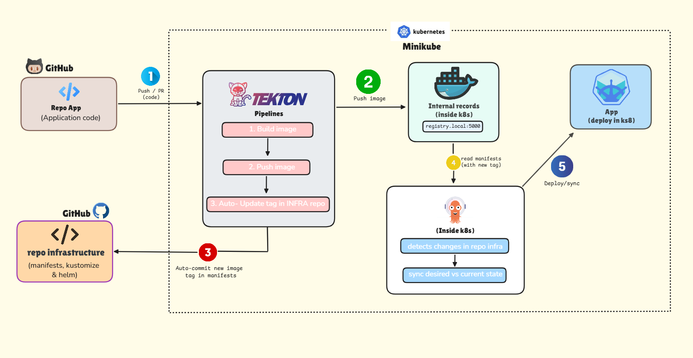
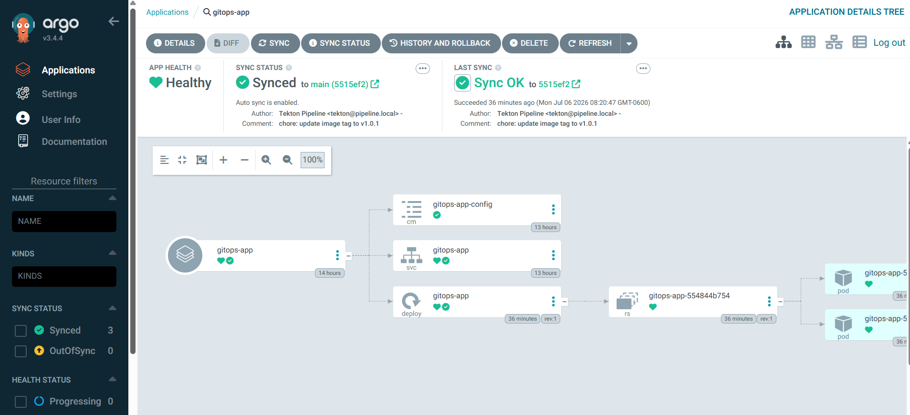

# gitops-app

A demo Node.js/Express API deployed through a full GitOps CI/CD pipeline — Tekton builds and pushes the image, ArgoCD syncs it to Kubernetes.

Idea and inspiration by **Javi Martinez | DevOps** — [j.martinez.sh](https://instagram.com/j.martinez.sh) on Instagram.


## Architecture



## Tech Stack

| Layer            | Tool                      |
|------------------|---------------------------|
| Application      | Node.js + Express         |
| CI (build/push)  | Tekton Pipelines + Kaniko |
| CD (deploy)      | ArgoCD                    |
| Cluster          | Kubernetes (Minikube)     |
| Manifests        | Kustomize                 |
| Local webhooks   | ngrok                     |

## What This Is

This project is a self-hosted GitOps loop: every code change pushed to `gitops-app` ends up running on a Kubernetes cluster with no manual `kubectl apply` or `docker push` in between. Two repos split the concerns:

- **`gitops-app`** — the application source and its `Dockerfile`. This is what developers touch.
- **`gitops-infra`** — the Kubernetes manifests (Deployment, Service, ConfigMap, Kustomization). This is what the cluster actually reads, and it's only ever updated by the pipeline, never by hand.

## Project Structure

```
gitops-app/          # application code
├── src/
│   └── server.js
├── Dockerfile
└── README.md

gitops-infra/         # Kubernetes manifests (separate repo)
├── base/
│   ├── deployment.yaml
│   ├── service.yaml
│   ├── configmap.yaml
│   └── kustomization.yaml

tekton/               # pipeline manifests (local only, applied via kubectl)
├── pipeline.yaml
├── tasks/
└── triggers/
```

## How It Works (Pipeline Flow)

1. A push to `gitops-app` triggers a GitHub webhook (tunneled locally via ngrok).
2. The webhook hits a Tekton EventListener, which kicks off the pipeline.
3. Tekton uses **Kaniko** to build the container image inside the cluster — no Docker daemon required — and pushes it to the registry.
4. Tekton then auto-commits the new image tag into `gitops-infra`.
5. **ArgoCD** watches `gitops-infra`, detects the change, and syncs the cluster to match — no one touches `kubectl` for the deploy.

## ArgoCD Dashboard



## API Endpoints

| Method | Path      | Description          |
|--------|-----------|----------------------|
| GET    | `/health` | Health check          |
| GET    | `/`       | Basic API response     |

## Key Learnings

- Kaniko enables in-cluster image builds without a Docker daemon, which fits naturally into a Tekton pipeline.
- Separating app code (`gitops-app`) from cluster state (`gitops-infra`) keeps the GitOps loop clean: CI never touches the cluster directly.
- ArgoCD's auto-sync turns a Git commit into the single source of truth for what's running.
- ngrok is a practical bridge for testing GitHub webhooks against a local Minikube cluster.
